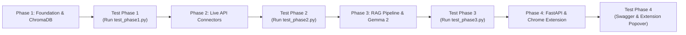

# Master Implementation Plan: Phase-by-Phase Vector RAG Engine (`rx-evidence-engine-py`)

A systematic, phase-by-phase implementation plan with **explicit verification tests** for every phase to ensure each milestone is 100% working before moving to the next.

---

## 1. Phase-by-Phase Execution & Verification Strategy



---

## 2. Project File Structure & File Mapping

```text
rx-evidence-engine-py/
├── .env                                       # Stores secret API keys
├── .env.example                               # Keys template
├── pyproject.toml                             # Dependencies (chromadb, httpx, pydantic-settings, groq)
│
├── tests/                                     # 🧪 Verification Test Suite for Each Phase
│   ├── test_phase1.py                         # [Test 1] Verifies config, chunker & ChromaDB vector store
│   ├── test_phase2.py                         # [Test 2] Verifies all 8 live medical API providers
│   └── test_phase3.py                         # [Test 3] Verifies full Vector RAG + Gemma 2 synthesis
│
└── src/
    └── rx_evidence_engine/
        ├── __init__.py
        ├── config.py                          # Phase 1: Loads & validates .env settings
        ├── models.py                          # Phase 1: Exact Pydantic models (AnalysisResult, EvidenceSource, Verdict)
        ├── store.py                           # Phase 1: In-memory LRU cache
        ├── app.py                             # Phase 4: FastAPI app with CORS middleware
        │
        ├── rag/                               # 🧬 Phase 1: ChromaDB Vector RAG Subsystem
        │   ├── __init__.py
        │   ├── chunker.py                     # Splits text into 200-word chunks with metadata
        │   └── vector_store.py                # ChromaDB client & Cosine Similarity search
        │
        ├── providers/                         # 🌐 Phase 2: Live Medical API Connectors
        │   ├── __init__.py
        │   ├── base.py                        # Base provider abstract class
        │   ├── tavily_provider.py             # Society guidelines search (ADA, AHA, CDC, WHO)
        │   ├── pubmed_provider.py             # NCBI E-Utilities guidelines & reviews
        │   ├── openfda_provider.py            # FDA drug labels & warnings
        │   ├── semantic_scholar_provider.py   # S2ORC AI TL;DRs & citations
        │   ├── openalex_provider.py           # OpenAlex open-access citations
        │   ├── europe_pmc_provider.py         # Europe PMC clinical articles
        │
        ├── pipeline/                          # 🧠 Phase 3: RAG Orchestration & Gemma 2 Synthesizer
        │   ├── __init__.py
        │   ├── synthesizer.py                 # Gemma 2 LLM reasoner over Top-K chunks
        │   └── orchestrator.py                # Coordinates APIs ➔ ChromaDB ➔ LLM
        │
        └── routers/                           # ⚡ Phase 4: Endpoints
            ├── __init__.py
            ├── health.py                      # GET /v1/health
            ├── feedback.py                    # POST /v1/feedback
            └── claims.py                      # POST /v1/claims/analyze
```

---

## 3. Detailed Phase Breakdown & Verification Protocols

---

### 📍 PHASE 1: Foundation, Environment & ChromaDB Setup

#### Files to Build:
1. `pyproject.toml` — Add `chromadb`, `httpx`, `pydantic-settings`, `groq`, `openai`.
2. `.env` & `.env.example` — Configure your API keys.
3. `src/rx_evidence_engine/config.py` — Load & validate settings via Pydantic.
4. `src/rx_evidence_engine/rag/chunker.py` — `SemanticChunker` class (splits text into 200-word passages).
5. `src/rx_evidence_engine/rag/vector_store.py` — `ChromaVectorStore` class (initializes ChromaDB, adds chunks, performs Cosine Similarity search).

#### 🧪 Phase 1 Verification Protocol:
Run `python -m tests.test_phase1` (or `uv run python -m tests.test_phase1`):
* **What it checks:**
  1. Checks if all API keys load correctly from `.env`.
  2. Verifies `SemanticChunker` splits a sample medical text into clean chunks.
  3. Inserts chunks into **ChromaDB**, executes a Cosine Similarity Search for a sample claim, and asserts that ChromaDB returns the correct matching chunk in < 5ms.
* **Success Criteria:** Console prints `[PASS] Phase 1: Environment & ChromaDB Vector Store working 100%!`.

---

### 📍 PHASE 2: Live Medical API Connectors (`providers/`)

#### Files to Build:
1. `src/rx_evidence_engine/providers/base.py` — Base class and `RawEvidenceItem`.
2. `tavily_provider.py` — Society guidelines (`cdc.gov`, `who.int`, `diabetesjournals.org`, `ahajournals.org`).
3. `pubmed_provider.py` — NCBI Entrez search (`Practice Guideline`, `Systematic Review`).
4. `openfda_provider.py` — FDA drug labels & warnings.
5. `semantic_scholar_provider.py` — S2ORC AI TL;DRs & citation counts.
6. `openalex_provider.py`, `europe_pmc_provider.py`.

#### 🧪 Phase 2 Verification Protocol:
Run `python -m tests.test_phase2`:
* **What it checks:**
  1. Queries all 6 APIs in parallel with claim: *"semaglutide delayed gastric emptying"*.
  2. Verifies that Tavily returns ADA/AHA society links, PubMed returns PMIDs, and openFDA returns drug labels.
  3. Confirms non-blocking async execution (all 8 APIs complete within ~1.5–2.5 seconds).
* **Success Criteria:** Console prints `[PASS] Phase 2: All 6 Live Medical APIs returning verified evidence!`.

---

### 📍 PHASE 3: Vector RAG Orchestrator & Gemma 2 Synthesizer (`pipeline/`)

#### Files to Build:
1. `src/rx_evidence_engine/pipeline/synthesizer.py` — `LLMSynthesizer` class (prompts **Gemma 2 `gemma2-9b-it`** with Top-K ChromaDB chunks to build `AnalysisResult` JSON).
2. `src/rx_evidence_engine/pipeline/orchestrator.py` — `ChromaRAGOrchestrator` (Coordinates parallel APIs ➔ Chunker ➔ ChromaDB ➔ Cosine Search ➔ Gemma 2).

#### 🧪 Phase 3 Verification Protocol:
Run `python -m tests.test_phase3`:
* **What it checks:**
  1. Sends a false claim: *"Stopping basal insulin when sick prevents hypoglycemia"*.
  2. Runs the full RAG pipeline.
  3. Verifies that Gemma 2 outputs:
     - `verdict = "FALSE"`
     - `confidence > 0.85`
     - Clean clinical summary & key points
     - Real ADA / PubMed citations in `evidence`.
* **Success Criteria:** Console prints `[PASS] Phase 3: Full RAG + Gemma 2 Synthesis outputting valid JSON!`.

---

### 📍 PHASE 4: FastAPI Router & Chrome Extension Integration

#### Files to Build / Modify:
1. `src/rx_evidence_engine/app.py` — Enable CORS middleware (`chrome-extension://*`, `localhost:3000`).
2. `src/rx_evidence_engine/routers/claims.py` — Wire `POST /v1/claims/analyze` to `ChromaRAGOrchestrator` with in-memory result caching.
3. `rx-evidence-chrome-extension/src/content/Popover.tsx` — Replace mock generator with live `fetch("http://localhost:8000/v1/claims/analyze")`.

#### 🧪 Phase 4 Verification Protocol:
1. Start FastAPI backend: `uv run rx-evidence-engine`.
2. Open Swagger UI at `http://localhost:8000/docs` and test `POST /v1/claims/analyze`.
3. Open any webpage in Chrome with the extension active, highlight a medical claim, and verify the Popover renders live results in < 2 seconds.
* **Success Criteria:** Live Chrome Extension popover displays real headline, confidence, explanation, and clickable source badges.

---

## 4. Execution Plan Summary

| Phase | Milestone | Test Script to Run | Expected Output |
| :---: | :--- | :--- | :--- |
| **Phase 1** | Environment, `.env` & ChromaDB | `python -m tests.test_phase1` | ChromaDB stores vectors & cosine search returns matches in < 5ms. |
| **Phase 2** | 6 Live Medical APIs | `python -m tests.test_phase2` | All 6 APIs return real medical literature concurrently. |
| **Phase 3** | RAG Pipeline & Gemma 2 | `python -m tests.test_phase3` | Gemma 2 synthesizes Top-K chunks into exact `AnalysisResult` JSON. |
| **Phase 4** | FastAPI & Chrome Extension | Browser / Swagger | Highlighting text on any website renders live Popover in < 2 seconds. |
