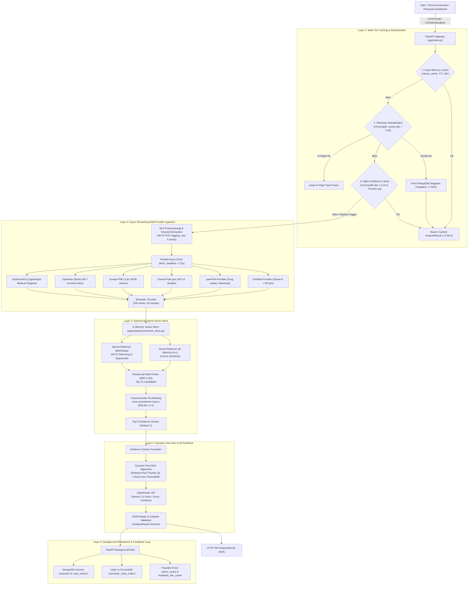
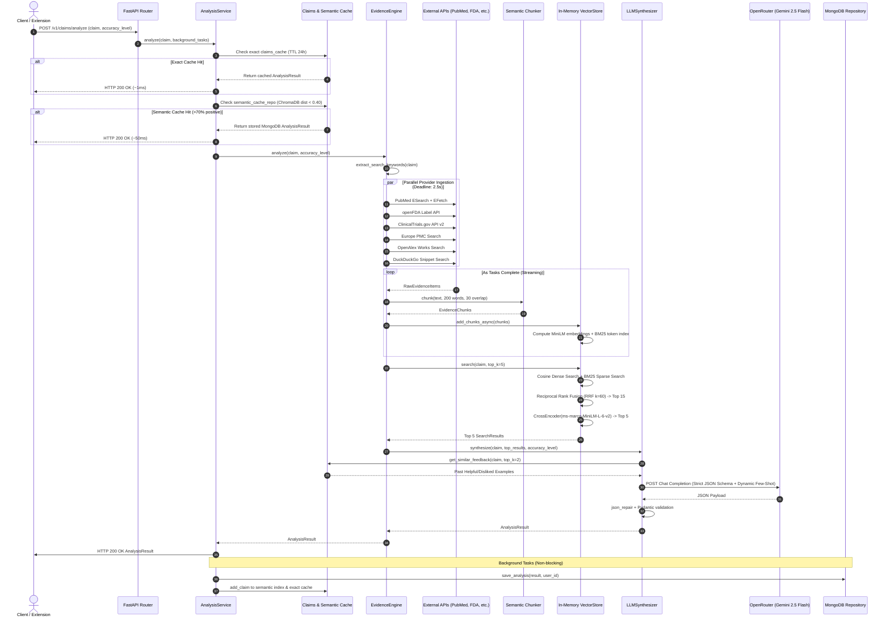
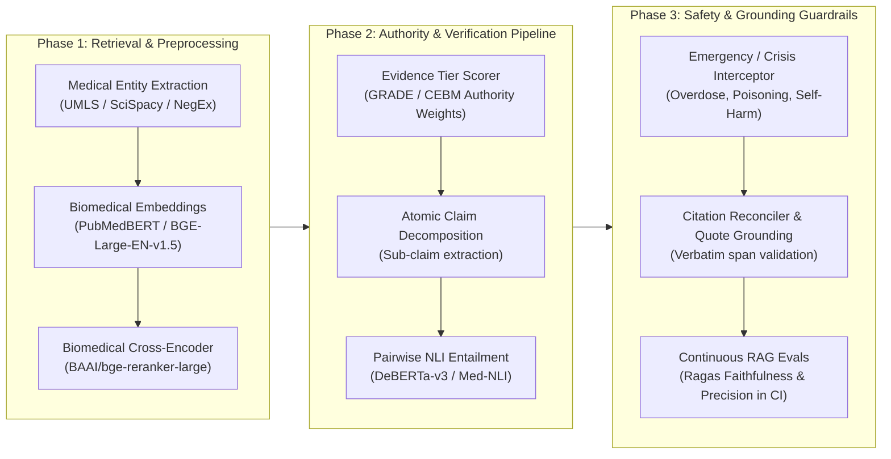

# RX Evidence Engine — Current Architecture & Accuracy Analysis

This document provides a complete technical specification of the **RX Evidence Engine**, covering its end-to-end data flow, retrieval-augmented generation (RAG) pipeline, multi-tier caching, external API providers, and machine learning models. It includes an in-depth audit against the **11 Pillars of Medical AI Accuracy**, followed by an actionable **Fix and Optimization Blueprint**.

---

## 1. System Architecture Overview

The RX Evidence Engine is an asynchronous, high-throughput medical claim verification backend built with FastAPI, hybrid dense/sparse vector search, cross-encoder neural re-ranking, and dynamic few-shot LLM synthesis.

### High-Level Architectural Flowchart



---

## 2. Component Inventory & Models Used

### Machine Learning & Embedding Models

| Component | Model / Engine | Purpose | Location |
| :--- | :--- | :--- | :--- |
| **Dense Embedder** | `sentence-transformers/all-MiniLM-L6-v2` | Dense semantic chunk embedding (384 dims) | [`app/shared/core/vector_store.py`](file:///Users/binoymanoj/Codes/rx-evidence/rx-evidence-engine-py/app/shared/core/vector_store.py) |
| **Re-Ranker** | `cross-encoder/ms-marco-MiniLM-L-6-v2` | Cross-attention query-chunk relevance scoring | [`app/shared/core/vector_store.py`](file:///Users/binoymanoj/Codes/rx-evidence/rx-evidence-engine-py/app/shared/core/vector_store.py) |
| **LLM Synthesizer** | `google/gemini-2.5-flash` (via OpenRouter) | Multi-document medical evidence synthesis & verdict generation | [`app/shared/core/synthesizer.py`](file:///Users/binoymanoj/Codes/rx-evidence/rx-evidence-engine-py/app/shared/core/synthesizer.py) |
| **Fast LLM Tiers** | `llm_model_low`, `llm_model_medium`, `llm_model_high` | Configurable per accuracy level (`low`, `medium`, `high`) | [`app/shared/core/config.py`](file:///Users/binoymanoj/Codes/rx-evidence/rx-evidence-engine-py/app/shared/core/config.py) |
| **Sparse Engine** | `BM25Okapi` (rank-bm25) | Lexical keyword matching | [`app/shared/core/vector_store.py`](file:///Users/binoymanoj/Codes/rx-evidence/rx-evidence-engine-py/app/shared/core/vector_store.py) |
| **NLP Tokenizer** | `NLTK` Snowball Stemmer + Perceptron POS Tagger | Stopword filtering, POS tagging, stemming | [`app/shared/core/nlp.py`](file:///Users/binoymanoj/Codes/rx-evidence/rx-evidence-engine-py/app/shared/core/nlp.py) |

### External Evidence Providers

| Provider | Data Source & Protocol | Query Strategy | Filters / Processing |
| :--- | :--- | :--- | :--- |
| **PubMed** | NCBI E-Utilities (`esearch.fcgi` + `efetch.fcgi`) | `(query) AND (Practice Guideline[pt] OR Systematic Review[pt] OR Meta-Analysis[pt] OR Clinical Trial[pt] OR Review[pt])` | XML parsing into abstract, title, journal, PMID |
| **openFDA** | openFDA Drug Label API (`api.fda.gov/drug/label.json`) | Regex sanitized query against `indications_and_usage`, `warnings`, `boxed_warning`, `adverse_reactions` | Aggregated label text truncated to 3000 chars |
| **ClinicalTrials.gov** | ClinicalTrials.gov API v2 (`/api/v2/studies`) | `query.term` search | Brief summary, detailed description, NCT ID, study status |
| **Europe PMC** | EMBL-EBI REST API (`/webservices/rest/search`) | REST JSON query | Open access preprints, DOIs, PMIDs, citation counts |
| **OpenAlex** | OpenAlex Works API (`api.openalex.org/works`) | Concept search with inverted index abstract reconstruction | DOI, landing page, publication year, citations |
| **DuckDuckGo** | `ddgs.text` via `DDGS()` backend | Append `"{query} medical health evidence"` | Fast snippets with domain mapping (CDC, WHO, Mayo Clinic, NIH, etc.) |

### Database & Storage Infrastructure

1. **MongoDB (Motor AsyncIO)**:
   - Collection `chrome-extension`: Analyzed claim documents, counts, positive/negative/none feedback counts.
   - Collection `user_claims`: User-to-claim history mapping.
   - Collection `users`: Authentication, bcrypt password hashes, JWT tokens, profile data.
   - Collection `appointments` & `reschedule_requests`: Physician dashboard appointment management.
2. **ChromaDB (`.chroma`)**:
   - Collection `semantic_claim_index`: Semantic claim embeddings with cosine distance for deduplication.
   - Collection `claim_feedback`: User feedback embeddings used for dynamic few-shot alignment and prompt steering.
3. **In-Memory Cachetools TTLCache**:
   - `claims_cache`: Max 10,000 items, 24-hour TTL for exact match queries.
   - `feedback_link_cache`: Max 10,000 items, 24-hour TTL for feedback attribution.
   - `_provider_cache`: Max 1,000 items, 300s TTL for upstream API caching.

---

## 3. Detailed Audit of Accuracy Mechanisms (11 Pillars)

| # | Accuracy Pillar | Implementation Status | Current Implementation Details | Gaps & Failure Modes |
| :--- | :--- | :---: | :--- | :--- |
| **1** | **High-Quality Corpus** | ⚠️ **Partial** | Multi-source live ingestion from PubMed, openFDA, ClinicalTrials.gov, Europe PMC, OpenAlex, and DDG. PubMed queries filter for guidelines, meta-analyses, and clinical trials. | • 100% dynamic API calls with no pre-indexed golden corpus.<br/>• DDG search snippets are unverified and lightweight.<br/>• No evidence tier weighting (preprints vs FDA labels treated equally). |
| **2** | **Correct Retrieval** | ⚠️ **Partial** | Hybrid retrieval combining dense cosine similarity (`all-MiniLM-L6-v2`) and sparse BM25 with Snowball stemming, merged using Reciprocal Rank Fusion (RRF $k=60$). | • Keyword extraction truncates queries to 4 words via basic POS tagging, dropping negations ("not", "never") and clinical qualifiers.<br/>• Strict "OR" join in PubMed can flood results with unrelated papers.<br/>• No MeSH / UMLS synonym expansion. |
| **3** | **Strong Re-Ranking** | ⚠️ **Partial** | Neural cross-encoder (`cross-encoder/ms-marco-MiniLM-L-6-v2`) scores query-chunk pairs, with sigmoid mapping to $[0, 1]$. | • MS-MARCO model is trained on web search, not biomedical literature.<br/>• Hardcoded top-15 candidate bottleneck discards valid chunks prior to cross-encoding.<br/>• No authority/recency adjustment in re-ranking. |
| **4** | **Evidence Authority** | ❌ **Missing** | Basic domain mapping for DuckDuckGo (`CDC`, `WHO`, `Mayo Clinic`); publication type filter in PubMed. | • No formal Evidence Hierarchy (GRADE / Oxford CEBM levels).<br/>• Authority is not scored or factored into ranking math.<br/>• A low-tier preprint can outrank an FDA black-box warning if textual overlap is higher. |
| **5** | **Evidence Sufficiency Threshold** | ⚠️ **Partial** | Synthesizer returns zero confidence if no chunks exist. Engine has an early short-circuit if 3 chunks have score $> 0.8$. | • If 1 low-relevance chunk ($0.35$) is retrieved, it still proceeds to LLM synthesis without being flagged as insufficient.<br/>• Early short-circuit ($>0.8$ score) on un-reranked dense search can abort before PubMed/FDA arrive. |
| **6** | **Grounded Generation** | ⚠️ **Partial** | Strict system prompt instruction ("Do NOT use outside knowledge"), low temperature ($0.1$), structured JSON schema. | • No requirement for verbatim text extraction / source sentence quoting.<br/>• LLM can hallucinate subtle clinical mechanisms in `summary` and `keyPoints` without chunk-level attribution. |
| **7** | **Claim-Level Verification** | ❌ **Missing** | The claim is evaluated as a single monolithic string in one pass. | • Complex multi-predicate claims (e.g., *"Drug X cures Y and is FDA approved for Z"*) are not broken down into atomic sub-claims.<br/>• Cannot produce partial verdicts (Sub-claim A: True, Sub-claim B: False). |
| **8** | **Citation Verification** | ⚠️ **Partial** | Synthesizer outputs an `evidence` array validated with Pydantic (`title`, `publisher`, `url`, `stance`, `relevance`). | • No programmatic URL verification: LLM can hallucinate URLs or mismatch titles.<br/>• No inline citation tags (`[1]`, `[2]`) referencing specific evidence indices in summary sentences. |
| **9** | **Contradiction Detection** | ⚠️ **Partial** | Prompt instructs LLM to set confidence to $0.4-0.6$ on conflicting evidence and assign stance (`supports`, `contradicts`, `neutral`). | • Relies purely on LLM instruction following; no dedicated Natural Language Inference (NLI) model.<br/>• No conflict-resolution hierarchy when conflicting studies exist (e.g. meta-analysis vs small observational trial). |
| **10** | **Safety Guardrails** | ❌ **Missing** | Input length validation and openFDA warning extraction. | • No emergency/crisis detection (suicide, overdose, acute poisoning, anaphylaxis) with 911/emergency escalation.<br/>• No mandatory Medical Disclaimer enforcement.<br/>• No prompt injection / jailbreak protection on user claim input. |
| **11** | **Continuous Evaluation** | ⚠️ **Partial** | Thumbs up/down feedback stored in ChromaDB and MongoDB. Dynamic few-shot alignment injects user preferences. Automatic cache eviction when negative feedback exceeds 30%. | • No automated benchmark test suite (MedQA, HealthFact, BioASQ).<br/>• No RAG evaluation pipeline (Ragas / TruLens measuring Faithfulness, Context Precision, Recall).<br/>• No CI/CD regression testing for accuracy on prompt changes. |

---

## 4. End-to-End Execution Flow

### Step-by-Step Runtime Walkthrough



---

## 5. Architectural Fixes & Optimization Blueprint

To transform the RX Evidence Engine into an enterprise-grade, clinical-standard evidence verification system, implement the following architectural enhancements:



### 1. Fix Keyword Extraction & Clinical Negation Handling
* **Problem**: `extract_search_keywords` uses naive POS tagging and truncates to 4 words, dropping negative qualifiers ("not", "does not cause", "ineffective") and altering clinical meaning.
* **Fix**:
  1. Integrate negation detection using regex or `NegEx` algorithm.
  2. Implement Medical Entity Recognition (NER) for drugs, conditions, and treatments using curated MeSH / RxNorm synonym expansion.
  3. Formulate targeted Boolean PubMed queries using `"AND"` logic for primary subject-condition pairs instead of naive `"OR"` chains.

### 2. Upgrade to Domain-Specific Biomedical Embeddings & Re-Rankers
* **Problem**: `all-MiniLM-L6-v2` and `ms-marco-MiniLM-L-6-v2` are trained on generic web crawl data and fail on subtle clinical terms (e.g., distinguishing contraindications from indications).
* **Fix**:
  1. Replace dense embedder with `BAAI/bge-small-en-v1.5` or `pritamdeka/S-PubMedBert-MS-MARCO`.
  2. Replace general cross-encoder with `BAAI/bge-reranker-large` or `cross-encoder/nli-deberta-v3-large`.
  3. Expand initial RRF re-ranking candidate pool from 15 to 30.

### 3. Implement Evidence Authority Weighting (GRADE Scale)
* **Problem**: Preprints and search snippets currently compete with official FDA labels and Cochrane meta-analyses on raw lexical similarity alone.
* **Fix**: Assign a deterministic Authority Score multiplier ($W_a \in [0.5, 1.5]$) during hybrid ranking:
  $$\text{Final Score} = \text{CrossEncoderScore} \times W_{\text{authority}} \times W_{\text{recency}}$$
  - **Tier 1 ($1.5\times$)**: FDA Boxed Warnings, Cochrane Systematic Reviews, CDC/WHO Practice Guidelines.
  - **Tier 2 ($1.3\times$)**: PubMed Clinical Trials & Meta-Analyses.
  - **Tier 3 ($1.0\times$)**: Observational Studies, Europe PMC peer-reviewed articles.
  - **Tier 4 ($0.7\times$)**: Preprints (MedRxiv/BioRxiv).
  - **Tier 5 ($0.5\times$)**: Web snippets (DuckDuckGo).

### 4. Implement Atomic Claim Decomposition & Claim-Level Verification
* **Problem**: Complex medical statements containing multiple clauses receive a single global verdict, masking specific inaccuracies.
* **Fix**:
  1. Pre-process claims through a lightweight decomposition step that extracts atomic propositions:
     - Example: *"Vitamin C prevents colds and cures COVID-19"* $\rightarrow$
       - Sub-claim 1: *"Vitamin C prevents the common cold"*
       - Sub-claim 2: *"Vitamin C cures COVID-19"*
  2. Evaluate evidence sufficiency and stance per sub-claim before synthesizing the unified verdict.

### 5. Automated Citation Reconciliation & Verbatim Quote Grounding
* **Problem**: The LLM can generate hallucinated evidence items, dead URLs, or ungrounded claims.
* **Fix**:
  1. **Strict Programmatic Citation Linking**: Map LLM output citations directly against the set of retrieved chunk URLs. If a URL was not in the retrieved context, reject or replace it.
  2. **Quote Grounding**: Require each key point to include a short `verbatimQuote` from the source chunk, validated via substring matching before returning to the client.

### 6. Clinical Safety Guardrails & Emergency Escalation
* **Problem**: No detection for life-threatening medical emergencies or harmful health advice.
* **Fix**:
  1. Add a regex & keyword classifier at the gateway layer for acute emergency terms (e.g., acute chest pain, suicidal ideation, poison ingestion, anaphylaxis).
  2. Immediately return an emergency advisory banner with hotline contact info (e.g., 911 / Poison Control) and bypass standard RAG latency.
  3. Automatically append standard medical disclaimers to all synthesis outputs.

### 7. Automated Continuous Evaluation (RAG Triad & Benchmarking)
* **Problem**: Accuracy is only evaluated reactively through user thumbs up/down feedback.
* **Fix**:
  1. Establish an automated evaluation dataset of 100 gold-standard medical claims covering:
     - Clear True Claims (e.g., *"Metformin is first-line for Type 2 Diabetes"*)
     - Clear False Claims / Viral Misinformation (e.g., *"Bleach cures autism"*)
     - Nuanced / Contested Claims (e.g., *"Aspirin for primary prevention in low-risk elderly"*)
  2. Integrate `Ragas` or `DeepEval` into the CI/CD pipeline to automatically calculate:
     - **Faithfulness** (no hallucinations beyond context)
     - **Answer Relevance** (direct answer to user query)
     - **Context Precision** (signal-to-noise in retrieved top-5 chunks)
     - **Context Recall** (all necessary clinical facts retrieved)

---

## 6. Architecture Summary Matrix

```
┌────────────────────────────────────────────────────────────────────────────────────────┐
│                                 RX EVIDENCE ENGINE                                     │
├─────────────────────────┬───────────────────────────────┬──────────────────────────────┤
│ Metric / Layer          │ Current Implementation        │ Target Optimized Architecture │
├─────────────────────────┼───────────────────────────────┼──────────────────────────────┤
│ Embedding Model         │ all-MiniLM-L6-v2 (384d)       │ S-PubMedBert-MS-MARCO / BGE  │
│ Re-Ranker               │ ms-marco-MiniLM-L-6-v2        │ BAAI/bge-reranker-large       │
│ Synthesis Model         │ Gemini 2.5 Flash (OpenRouter) │ Gemini 2.5 Flash / Claude 3.5│
│ Retrieval               │ BM25 + Dense + RRF (k=60)     │ Hybrid + NegEx + UMLS Synonyms│
│ Authority Weighting     │ None (Equal weight)           │ GRADE / CEBM Tier Multiplier │
│ Verification Granularity│ Monolithic full-claim         │ Atomic sub-claim resolution  │
│ Citation Integrity      │ LLM Generative JSON           │ Strict URL & Quote Grounding │
│ Emergency Guardrails    │ None                          │ Instant Crisis / Poison Triage│
│ Continuous Evaluation   │ Reactive User Feedback        │ Automated Ragas + CI/CD Gold │
└─────────────────────────┴───────────────────────────────┴──────────────────────────────┘
```
